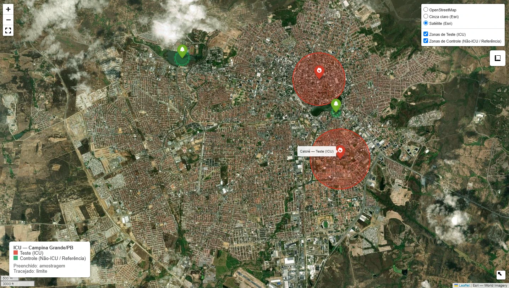

# Análise de Ilhas de Calor Urbanas (ICU) — Campina Grande / PB

Projeto focado no mapeamento, monitorização e comprovação científica do fenómeno de Ilhas de Calor Urbanas (ICU) no município de Campina Grande — PB. Utiliza dados de sensoriamento remoto, métricas microclimáticas e análises estatísticas rigorosas para comparar zonas de alta densidade urbana com áreas de preservação e corpos d'água.

---

## Visão Geral do Projeto

As Ilhas de Calor Urbanas (ICU) ocorrem quando áreas urbanizadas apresentam temperaturas significativamente superiores às zonas rurais ou arborizadas do seu entorno. 

Este projeto visa responder cientificamente às seguintes questões:
1. Qual é a intensidade da ilha de calor ($\Delta T$) em áreas comerciais e de alta densidade de Campina Grande em comparação com áreas de referência?
2. Existe uma correlação estatisticamente significativa entre a redução do Índice de Vegetação ($NDVI$) e o aumento da Temperatura de Superfície ($LST$)?

---

## Escopo Inicial & Pontos de Estudo

Para garantir uma amostragem inicial controlada e estatisticamente representativa, foram definidos 4 pontos estratégicos organizados em duas categorias:

| Ponto / Bairro | Categoria | Função Científica | Característica Urbana |
| :--- | :--- | :--- | :--- |
| **Centro** | **Teste (ICU)** | Zona de alta retenção térmica | Alta densidade construída, asfalto e baixa arborização. |
| **Catolé** | **Teste (ICU)** | Zona de expansão/verticalização | Densidade predial recente e vias pavimentadas. |
| **Parque da Criança** | **Controle (Não-ICU)** | Referência de área verde ($\bar{T}_{ref}$) | Zona verde arborizada no perímetro urbano. |
| **Açude de Bodocongó** | **Controle (Não-ICU)** | Referência de corpo hídrico ($\bar{T}_{ref}$) | Grande lâmina d'água e entorno permeável. |

---

## Metodologia & Fórmulas Científicas

### 1. Intensidade da Ilha de Calor ($I_{ICU}$)
Calculada como a diferença entre a temperatura da zona de teste e a média das zonas de referência:

$$I_{ICU}(i, t) = T(i, t) - \bar{T}_{ref}(t)$$

Onde:
* $T(i, t)$: Temperatura medida na área de teste $i$ no instante $t$.
* $\bar{T}_{ref}(t)$: Média das temperaturas nas áreas de controle no mesmo instante $t$.

### 2. Índice de Vegetação ($NDVI$)
Utilizado como variável explicativa extraída de dados orbitais:

$$NDVI = \frac{NIR - RED}{NIR + RED}$$

### 3. Validação Estatística
* **Teste de Normalidade:** Shapiro-Wilk.
* **Comparação de Médias:** Teste t de Student (para distribuições normais) ou Mann-Whitney U (não-paramétrico), com nível de significância $\alpha = 0.05$.
* **Análise de Regressão:** Correlação de Pearson/Spearman entre $I_{ICU}$ e $NDVI$.

---

## Tecnologias & Ferramentas Utilizadas

- **Linguagem Principal:** Python 3.10+
- **Geoprocessamento & Mapas:** geopandas, shapely, folium, rasterio
- **Sensoriamento Remoto:** Google Earth Engine API (ee), Dados orbitais Landsat 8/9
- **Análise de Dados & Estatística:** pandas, numpy, scipy, statsmodels
- **Visualização & Dashboard:** matplotlib, seaborn, streamlit, streamlit-folium

---

## Roadmap / Fases do Projeto

- [x] **Fase 1: Configuração do Terreno & Geodados**
  - Mapeamento geoespacial preliminar dos bairros.
  - Criação de buffers de amostragem no Centro, Catolé, Parque da Criança e Bodocongó.
  - Implementação do mapa interativo com controlo de camadas no folium.
- [ ] **Fase 2: Coleta de Dados Orbitais & Sensoriamento Remoto**
  - Integração com Google Earth Engine API.
  - Extração automatizada de bandas térmicas ($LST$) e vegetação ($NDVI$).
- [ ] **Fase 3: Engine de Cálculo & Métricas de ICU**
  - Limpeza de outliers e sincronização das séries temporais.
  - Computação automatizada do $I_{ICU}$ e exportação de datasets tabulados.
- [ ] **Fase 4: Validação Estatística & Científica**
  - Execução dos testes de hipótese ($p\text{-value} < 0.05$).
  - Geração das matrizes de correlação e regressão linear.
- [ ] **Fase 5: Dashboard Interativo**
  - Construção da aplicação em Streamlit com mapa de calor, gráficos temporais e cartões de KPI.

---

## Estado Atual do Projeto

Mapa interativo gerado na Fase 1, com as zonas de teste (vermelho) e de controle (verde) sobre imagem de satélite:



---

## Como Executar o Projeto (Fase 1)

### Pré-requisitos
Certifique-se de ter o Python 3.10+ instalado no seu sistema.

### Passo a Passo

1. **Clonar o repositório:**
   ```bash
   git clone https://github.com/MilitaoAraujo/analise-geospacial-ilhas-de-calor.git
   cd analise-geospacial-ilhas-de-calor
   ```

2. **Criar e ativar um ambiente virtual:**
   ```bash
   python -m venv .venv
   ```
   - Windows (PowerShell): `.\.venv\Scripts\Activate.ps1`
   - Linux / macOS: `source .venv/bin/activate`

3. **Instalar as dependências:**
   ```bash
   pip install -r requirements.txt
   ```

4. **Executar o script da Fase 1:**
   ```bash
   python fase1_mapa_areas_estudo.py --abrir
   ```
   O mapa interativo é salvo em `saida/mapa_areas_estudo.html`, junto com os arquivos
   `areas_limites.geojson` e `areas_amostragem.geojson`.
